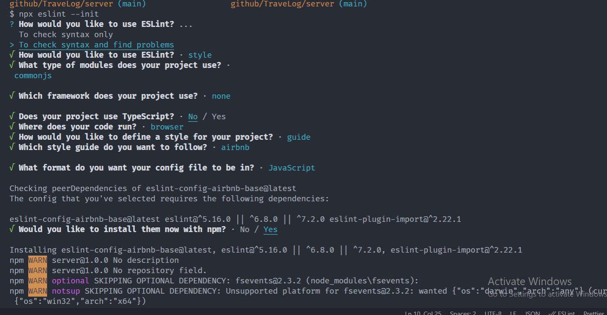

# TraveLog
A full (MERN) stack application for creating & listing travel logs


# Contents
```
[✔] Setup Server  
  [✔] Install Dependencies
  [✔] Install/Setup Linter
  [✔] Setup Express App
  [✔] Setup Not Found & Error Middlewares
[❕] Model DB
  [❕] What data will we store?
[❕] Setup Mongoose Model(s)
[❕] POST /logs
  [❕] Create a new log entry
[❕] GET /logs
  [❕] List all log entries
[❕] Setup Client
[❕] Create Form to add a new entry
[❕] Setup Map SDK on client
[❕] List all lg entries on map
```

## Setup Server

1. Create a folder `server` & Initialise npm package `npm init -y`
2. Install Base dependencies
    - express
    - cors
    - morgan -> for logging
    - helmet -> middleware for secure headers

    `npm i express cors mogan helmet`

3. Install Dev dependencies
    - eslint
    - nodemon
  
    `npm i -D eslint nodemon`
4. Create a folder `src` to hold source code
5. Create `index.js` in src folder
6. Setup `scripts` in package.json
   ```json
   "scripts": {
    "test": "echo \"Error: no test specified\" && exit 1",
    "start": "node src/index.js",
    "dev": "nodemon src/index.js",
    "lint": "eslint src/"
    }
    ```


7. Setup `eslint` with `airbnb` styleguide.
  
  

8. 